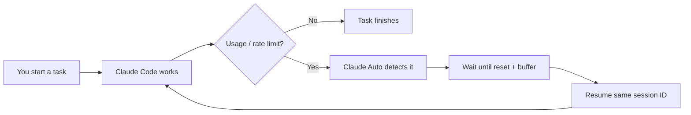

<div align="center">

# Claude Auto

### Keep Claude Code running through usage limits — same session, automatically.

[](https://www.npmjs.com/package/claude-auto)
[](https://nodejs.org/)
[](./LICENSE)
[](#platforms)

```text
 ┌──────────────┐     ┌──────────────┐     ┌──────────────┐
 │  long task   │ ──▶ │ usage limit  │ ──▶ │  auto wait   │
 └──────────────┘     └──────────────┘     └──────────────┘
                                                    │
                                                    ▼
 ┌──────────────┐     ┌──────────────┐     ┌──────────────┐
 │ task resumes │ ◀── │ same session │ ◀── │   reset OK   │
 └──────────────┘     └──────────────┘     └──────────────┘
```

**Local · No telemetry · No new session after a limit**

[Install](#-install) · [Quick start](#-quick-start) · [Commands](#-commands) · [Config](#-configuration) · [FAQ](#-faq)

</div>

---

## Why Claude Auto?

| Without Claude Auto | With Claude Auto |
| :---: | :---: |
| Hit a limit → stop | Hit a limit → **wait** |
| Come back later | Resume **automatically** |
| Risk losing the thread | **Same session** every time |
| Manual “continue” | Continuation prompt (prompt mode) |



> Independent community wrapper around the Claude Code CLI.  
> **Not** affiliated with, sponsored by, or endorsed by Anthropic.

---

## Install

**Prerequisites**

| Tool | Check |
| --- | --- |
| **Node.js 20+** | `node --version` |
| **Claude Code** on `PATH` | `claude --version` |

```bash
npm install -g claude-auto
```

Verify your setup:

```bash
claude-auto --doctor
```

<details>
<summary><strong>Expected doctor output</strong></summary>

```text
Claude Auto Doctor
──────────────────────────────
claude-auto 1.0.0

Operating system       ✓  …
Architecture           ✓  …
Node.js                ✓  v20+
npm                    ✓  …
Claude Code installed  ✓  …
Claude Code version    ✓  …
Session support        ✓  --session-id …
Resume support         ✓  --resume …
…
```

</details>

One-shot without a global install:

```bash
npx claude-auto --doctor
```

---


---

## VS Code / Cursor (Claude Code)

Claude Auto can arm Claude Code’s built-in continue-after-limit (works in the IDE):

```bash
claude-auto ide install
```

Then reload the Claude Code window and type:

```text
/claude-auto
```

| Command | Effect |
| --- | --- |
| `claude-auto ide install` | Install `/claude-auto` + turn **on** `autoContinueAtUsageLimit` |
| `claude-auto ide status` | Show whether auto-continue is on |
| `claude-auto ide disable` | Turn it off |
| `/claude-auto` | Slash command inside Claude Code |
| `/claude-auto:off` | Disable (when plugin loaded) |

This uses Claude Code’s official setting so the **same session** waits and continues inside VS Code/Cursor. The terminal wrapper (`claude-auto` / `--prompt`) is still best for long unattended CLI jobs.


## Quick start

<table>
<tr>
<td width="50%" valign="top">

### Interactive

Open Claude like usual:

```bash
claude-auto
```

Chat normally. Claude Auto stays quiet until a limit stops the run.

</td>
<td width="50%" valign="top">

### Prompt mode *(best for long jobs)*

```bash
claude-auto --prompt "Build auth end to end"
```

Or:

```bash
claude-auto "Refactor billing + tests"
```

Watches output → waits → resumes **same** session → continues.

</td>
</tr>
</table>

---

## When a limit hits

```text
────────────────────────────────────────
Claude Auto
────────────────────────────────────────

Claude usage limit detected.

Waiting for reset...

Estimated reset:
    23:30:05

Remaining:
    28m 41s

Resumes:
    2 / 20

Press Ctrl+C to stop.
```

| Control | Effect |
| --- | --- |
| Wait it out | Auto-resumes when the window opens |
| `Ctrl+C` | Cancel cleanly (does **not** start a new session) |
| `--no-countdown` | Quiet wait, no live timer |

---

## Commands

| | Command | What it does |
| :---: | --- | --- |
| ▶ | `claude-auto` | Interactive Claude Code |
| 🚀 | `claude-auto --prompt "…"` | Unattended task + auto-resume |
| ↺ | `claude-auto --resume` | Recover after crash / closed terminal |
| ✓ | `claude-auto --resume --yes` | Recover without confirmation prompt |
| ⌕ | `claude-auto --doctor` | Check Node, PATH, Claude, resume support |
| ▧ | `claude-auto --mock` | Demo the full loop (no real Claude API) |
| ? | `claude-auto --help` | Full option list |

Pass Claude Code flags through after `--`:

```bash
claude-auto --prompt "Fix flaky tests" -- --model sonnet
```

---

## How it works

```text
 1  create session UUID
 2  start:  claude --session-id <uuid> …
 3  on limit (stdout OR session transcript) → save state → wait
 4  resume: claude --resume <uuid> … (+ continuation prompt)
 5  never invent a replacement session
```

Interactive Claude stays open on a limit screen — so Claude Auto also watches
`~/.claude/projects/.../<session-id>.jsonl` for `rate_limit` / `resetsAt`, then
stops Claude, waits, and resumes the same session.

| Mode | Detection | Resume |
| --- | --- | --- |
| **Prompt / print** | Reads Claude stdout/stderr | Strong for AFK / overnight jobs |
| **Interactive** | Watches session transcript while the TUI stays open | Detect → wait → resume same session automatically |

Claude Code **≥ 2.1.234** also has a native “Continue automatically at usage limit” setting. Claude Auto still helps with print-mode loops, recovery, and when that setting is off.

---

## Configuration

**Config file (optional)**

| OS | Path |
| --- | --- |
| macOS / Linux | `~/.config/claude-auto/config.json` |
| Windows | `%APPDATA%\claude-auto\config.json` |

```json
{
  "fallbackResetSeconds": 1800,
  "resetBufferSeconds": 5,
  "maxAutoResumes": 20,
  "continuationPrompt": "Continue from where you stopped. Do not repeat completed work. Inspect the project and finish the original task.",
  "countdown": true,
  "verbose": false,
  "autoResume": true
}
```

**Same knobs from the CLI**

```bash
claude-auto --prompt "…" \
  --max-resumes 10 \
  --fallback-reset 1800 \
  --reset-buffer 5 \
  --continuation-prompt "Continue from the current state." \
  --verbose
```

| Key | Default | Meaning |
| --- | ---: | --- |
| `fallbackResetSeconds` | `1800` | Wait if Claude didn’t publish a reset time |
| `resetBufferSeconds` | `5` | Extra seconds after reset before retry |
| `maxAutoResumes` | `20` | Safety cap against infinite loops |
| `continuationPrompt` | *(built-in)* | Only sent when resuming print mode |

CLI flags always override the file.

---

## Platforms

```text
  ┌─────────┐   ┌─────────┐   ┌─────────┐
  │  macOS  │   │  Linux  │   │ Windows │
  │    ✓    │   │    ✓    │   │    ✓    │
  └─────────┘   └─────────┘   └─────────┘
```

---

## Privacy

```text
  your machine
  ┌─────────────────────────────┐
  │  claude-auto  ──▶  claude   │
  │                             │
  │  no server · no account     │
  │  no telemetry · no uploads  │
  └─────────────────────────────┘
```

State on disk is minimal (session id, status, resume count) — never API keys or chat contents.

---

## FAQ

<details>
<summary><strong>Claude Code was not found</strong></summary>

Install Claude Code, confirm `claude --version`, then run `claude-auto --doctor`.
</details>

<details>
<summary><strong>Session could not be resumed</strong></summary>

Claude Auto reports this clearly and **does not** invent a new session. Start a fresh run only if you intend to.
</details>

<details>
<summary><strong>No reset time in the message</strong></summary>

It waits `fallbackResetSeconds` (default 30 minutes) and labels that wait as a fallback — not a guessed server time.
</details>

<details>
<summary><strong>“Another Claude Auto instance…”</strong></summary>

Another process holds the lock. Close it, or wait for it to finish.
</details>

More: [docs/TROUBLESHOOTING.md](./docs/TROUBLESHOOTING.md)

---

## CLI reference

```text
Usage:
  claude-auto [prompt]
  claude-auto --prompt <text>
  claude-auto --resume
  claude-auto --doctor
  claude-auto --mock

Options:
  --prompt <text>
  --resume
  --max-resumes <number>
  --fallback-reset <seconds>
  --reset-buffer <seconds>
  --continuation-prompt <text>
  --no-countdown
  --verbose
  --config <path>
  --yes
  --doctor
  --mock
  --version
  --help
```

---

## Website

Next.js landing site in `web/` (use case + install):

```bash
cd web
npm install
npm run dev
```

## Contributing

```bash
npm install
npm run typecheck && npm run lint && npm test && npm run build
```

[Contributing guide](./CONTRIBUTING.md) · [Architecture](./docs/ARCHITECTURE.md) · [Technical design](./docs/TECHNICAL-DESIGN.md) · [Security](./SECURITY.md)

---

<div align="center">

**MIT** © Claude Auto contributors · [LICENSE](./LICENSE)

Claude Auto depends on your installed Claude Code CLI.  
Claude Code changes may require updates here.

</div>
